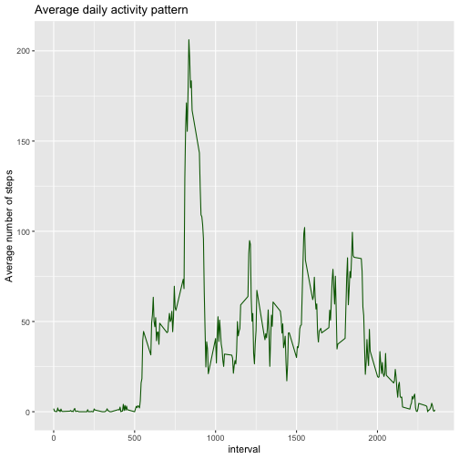

# Opening libraries


```r
  library(dplyr)
  library (ggplot2)
  library(knitr)
```
  
# Code for reading in the dataset and/or processing the data


```r
  setwd("~/Documents/Data Science Specialisation/Rerpoducible_Research")
  activity <- read.csv("./activity.csv")
```
 

```r
activity$date <- as.POSIXct(activity$date, "%Y-%m-%d")
```

```
## Warning in strptime(xx, f, tz = tz): unknown timezone '%Y-%m-%d'
```

```
## Warning in as.POSIXct.POSIXlt(x): unknown timezone '%Y-%m-%d'
```

```
## Warning in strptime(xx, f, tz = tz): unknown timezone '%Y-%m-%d'
```

```
## Warning in as.POSIXct.POSIXlt(x): unknown timezone '%Y-%m-%d'
```

```
## Warning in strptime(xx, f, tz = tz): unknown timezone '%Y-%m-%d'
```

```
## Warning in as.POSIXct.POSIXlt(x): unknown timezone '%Y-%m-%d'
```

```
## Warning in strptime(xx, f, tz = tz): unknown timezone '%Y-%m-%d'
```

```
## Warning in as.POSIXct.POSIXlt(x): unknown timezone '%Y-%m-%d'
```

```
## Warning in strptime(xx, f, tz = tz): unknown timezone '%Y-%m-%d'
```

```
## Warning in as.POSIXct.POSIXlt(x): unknown timezone '%Y-%m-%d'
```

```
## Warning in strptime(x, f, tz = tz): unknown timezone '%Y-%m-%d'
```

```
## Warning in as.POSIXct.POSIXlt(as.POSIXlt(x, tz, ...), tz, ...): unknown timezone '%Y-%m-%d'
```

```r
weekday <- weekdays(activity$date)
```

```
## Warning in as.POSIXlt.POSIXct(x, tz): unknown timezone '%Y-%m-%d'
```

```r
activity <- cbind(activity,weekday)
```
  

```r
activity$date <- as.Date(strptime(activity$date, format="%Y-%m-%d"))
```

```
## Warning in as.POSIXlt.POSIXct(x, tz): unknown timezone '%Y-%m-%d'
```

```r
activity$daytype <- sapply(activity$date, function(x) {
  if (weekdays(x) == "Saturday" | weekdays(x) =="Sunday") 
  {y <- "Weekend"} else 
  {y <- "Weekday"}
  y
  })
```
  

```r
summary(activity)
```

```
##      steps             date               interval           weekday       daytype         
##  Min.   :  0.00   Min.   :2012-10-01   Min.   :   0.0   Friday   :2592   Length:17568      
##  1st Qu.:  0.00   1st Qu.:2012-10-16   1st Qu.: 588.8   Monday   :2592   Class :character  
##  Median :  0.00   Median :2012-10-31   Median :1177.5   Saturday :2304   Mode  :character  
##  Mean   : 37.38   Mean   :2012-10-31   Mean   :1177.5   Sunday   :2304                     
##  3rd Qu.: 12.00   3rd Qu.:2012-11-15   3rd Qu.:1766.2   Thursday :2592                     
##  Max.   :806.00   Max.   :2012-11-30   Max.   :2355.0   Tuesday  :2592                     
##  NA's   :2304                                           Wednesday:2592
```
  
# Mean total number of steps taken per day

## Total number of steps taken per day.
  

```r
    by_date <- aggregate(steps~date, activity, sum, na.rm = TRUE)
```
  
## Histogram of the total number of steps taken each day.


```r
ggplot(by_date, aes(x = steps)) +
      geom_histogram(col = "white", fill = "orange", breaks = seq(0,22500, by=2500)) +
      ggtitle("Total number of steps taken per day") + 
      xlab("Steps") +
      ylab("Number of days")
```


## Mean and median of the total number of steps taken per day


```r
mean(by_date$steps, na.rm = TRUE)
```

```
## [1] 10766.19
```

```r
median(by_date$steps, na.rm = TRUE)
```

```
## [1] 10765
```

# Average daily activity pattern

## Time series plot of the average number of steps taken


```r
    by_interval <- aggregate(steps~interval, activity, mean, na.rm = TRUE)
    
    ggplot(by_interval, aes(x = interval, y = steps)) +
      geom_line(col = "darkgreen") +
      ggtitle("Average daily activity pattern") +
      ylab("Average number of steps")
```



## 5-minute interval that contains the maximum number of steps


```r
    time_series <- tapply(activity$steps, activity$interval, mean, na.rm = TRUE)
    max_interval <- which.max(time_series)
    names(max_interval)
```

```
## [1] "835"
```

# Imputting missing values

## Total number of missing values in the dataset


```r
  summary(activity)
```

```
##      steps             date               interval           weekday       daytype         
##  Min.   :  0.00   Min.   :2012-10-01   Min.   :   0.0   Friday   :2592   Length:17568      
##  1st Qu.:  0.00   1st Qu.:2012-10-16   1st Qu.: 588.8   Monday   :2592   Class :character  
##  Median :  0.00   Median :2012-10-31   Median :1177.5   Saturday :2304   Mode  :character  
##  Mean   : 37.38   Mean   :2012-10-31   Mean   :1177.5   Sunday   :2304                     
##  3rd Qu.: 12.00   3rd Qu.:2012-11-15   3rd Qu.:1766.2   Thursday :2592                     
##  Max.   :806.00   Max.   :2012-11-30   Max.   :2355.0   Tuesday  :2592                     
##  NA's   :2304                                           Wednesday:2592
```

## Strategy for filling in all of the missing values in the dataset.


```r
    activity_nomissing <- activity
    for (i in unique(activity_nomissing$interval)) {
      activity_nomissing$steps[is.na(activity_nomissing$steps) & activity_nomissing$interval == i] <- round(mean(activity_nomissing$steps[activity$interval == i], na.rm = T))
    }
```

## Histogram of the total number of steps taken each day & mean and median total number 
## of steps taken per day.


```r
    by_date_nomossing <- with(activity_nomissing, aggregate(steps, by = list(date), FUN=sum, na.rm = TRUE))
    names(by_date_nomossing) <- c("Date", "Steps")
```


```r
    ggplot(by_date_nomossing, aes(x = Steps)) +
      geom_histogram(col = "white", fill = "purple", breaks = seq(0,22500, by=2500)) +
      ggtitle("Total number of steps taken per day") + 
      xlab("Steps") +
      ylab("Number of days")
```


```r
  mean(by_date_nomossing$Steps, na.rm = TRUE)
```

```
## [1] 10765.64
```

```r
  median(by_date_nomossing$Steps, na.rm = TRUE) 
```

```
## [1] 10762
```

# Differences in activity patterns between weekdays and weekends.


```r
  by_interval_daytype <- aggregate(steps~interval + daytype, activity, mean, na.rm = TRUE)
   
     ggplot(by_interval_daytype, aes(x = interval , y = steps, color = daytype)) +
      geom_line() +
      labs(title = "Average daily steps by wekkday", x = "Interval", y = "Average number of steps") +
      facet_wrap(~daytype, nrow = 2, ncol = 1)
```


